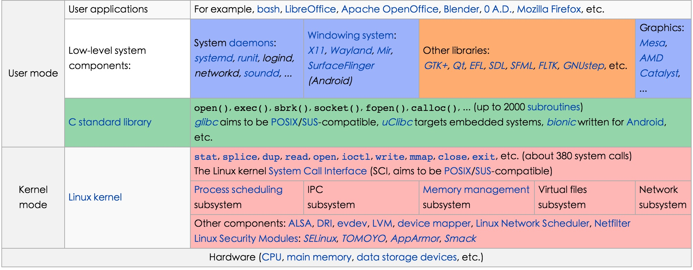
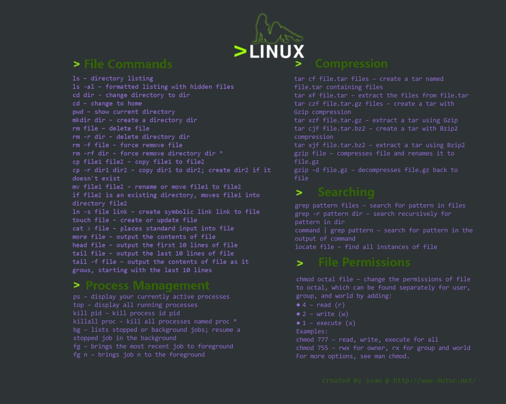
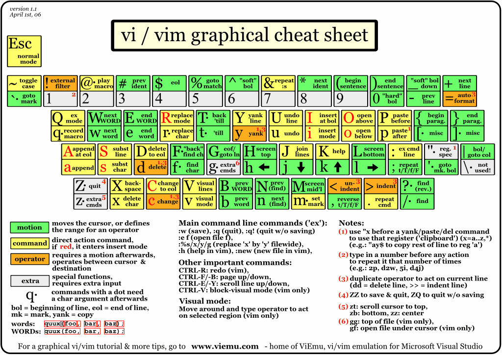

# linux基础

## 系统版本

linux常用的版本主要有以下几种：Debian，Gentoo，Ubuntu，RedHat，CentOS，Fedora，Kali Linux，Arch Linux，OpenSuse。不同版本针对的用户群也不尽相同，基本情况如下：

- Debian：

Debian运行起来极其稳定，这使得它非常适合用于服务器。Debian平时维护三套正式的软件库和一套非免费软件库，这给另外几款发行版（比如Ubuntu和Kali等）带来了灵感。Debian这款操作系统派生出了多个Linux发行版。它有37500多个软件包，这方面唯一胜过Debian的其他发行版只有Gentoo。Debian使用apt或aptitude来安装和更新软件。

Debian这款操作系统无疑并不适合新手用户，而是适合系统管理员和高级用户。Debian支持如今的大多数架构（处理器）。

- Gentoo

与Debian一样，Gentoo这款操作系统也包含数量众多的软件包。Gentoo并非以预编译的形式出现，而是每次需要针对每个系统进行编译。连Gentoo社区都觉得Gentoo安装和使用起来很困难；不过它被认为是最佳学习对象，可以进而了解Linux操作系统的内部运作原理。提到Gentoo总有人这么说："如果你要学用Linux发行版，那就学用该发行版吧；如果你学会了Gentoo，也就学会了Linux。"Gentoo使用portage来安装和更新软件。

Gentoo这款操作系统适合对Linux已经完全驾轻就熟的那些用户。

- Ubuntu

Ubuntu是Debian的一款衍生版，也是当今最受欢迎的免费操作系统。Ubuntu侧重于它在这个市场的应用，在服务器、云计算、甚至一些运行Ubuntu Linux的移动设备上很常见。作为Debian Gnu Linux的一款衍生版，Ubuntu的进程、外观和感觉大多数仍然与Debian一样。它使用apt软件管理工具来安装和更新软件。它也是如今市面上用起来最容易的发行版之一。Ubuntu使用基于apt的程序包管理器。

Ubuntu是新手用户肯定爱不释手的一款操作系统。

- RedHat

这是第一款面向商业市场的Linux发行版。它有服务器版本，支持众多处理器架构，包括x86和x86_64。红帽公司通过课程红帽认证系统管理员/红帽认证工程师（RHCSA/RHCE），对系统管理员进行培训和认证。就全球市场而言，总利润中80%来自支持，另外20%来自培训和认证，不过在印度不是这样。

如果安全是关注的首要问题，那么红帽企业级Linux的确是款完美的发行版，它使用YUM程序包管理器。红帽企业级Linux是系统管理员的第一选择，它有众多的程序包，还有非常到位的支持。由于该发行版是商业化产品，所以不是免费的。不过，你可以下载用于教学用途的测试版。

- CentOS

CentOS是一款企业级Linux发行版，它使用红帽企业级Linux中的免费源代码重新构建而成。这款重构版完全去掉了注册商标以及Binary程序包方面一个非常细微的变化。有些人不想支付一大笔钱，又能领略红帽企业级Linux；对他们来说，CentOS值得一试。此外，CentOS的外观和行为似乎与母发行版红帽企业级Linux如出一辙。 CentOS使用YUM来管理软件包。

非常稳定的程序包；谁要是想在桌面端测试一下服务器的运作原理，都应该试试这款操作系统。

- Fedora

小巧的Fedora适合那些人：想尝试最先进的技术，等不及程序的稳定版出来。其实，Fedora就是红帽公司的一个测试平台；产品在成为企业级发行版之前，在该平台上进行开发和测试。Fedora是一款非常好的发行版，有庞大的用户论坛，软件库中还有为数不少的软件包。Fedora同样使用YUM来管理软件包。

- Kali Linux

Kali Linux是Debian的一款衍生版。Kali旨在用于渗透测试。Kali的前身是Backtrack。用于Debian的所有Binary软件包都可以安装到Kali Linux上，而Kali的魅力或威力就来自于此。此外，支持Debian的用户论坛为Kali加分不少。Kali随带许多的渗透测试工具，无论是Wifi、数据库还是其他任何工具，都设计成立马可以使用。Kali使用APT来管理软件包。

毫无疑问，Kali Linux是一款渗透测试工具，或者是黑客青睐的操作系统。

- Arch Linux

Arch是一款采用滚动发行方式的操作系统：只要安装一次就够了；每当发行了某个新版本，就可以升级发行版，不需要重新安装。Pacman是Arch Linux的软件包管理器。Arch Linux既支持X86处理器架构，又支持X86_64架构，安装程序可以从光盘或U盘来运行。Arch旨在从开发者的角度而不是从用户的角度做到力求简单。Arch配置和安装起来超容易。它真是一款面向高手的发行版，让你可以了解Linux系统的每一个细枝末节。

- OpenSuse

OpenSuse这款Linux发行版是免费的，并不供商业用途使用，仍然供个人使用。OpenSuse的真正竞争对手是红帽企业级Linux。它使用Yast来管理软件包。有了Yast，使用和管理服务器应用程序就非常容易。此外，Yast安装向导程序可以配置电子邮件服务器、LDAP服务器、文件服务器或Web服务器，没有任何不必要的麻烦。它随带snapper快照管理工具，因而可以恢复或使用旧版的文件、更新和配置。由于让滚动发行版本成为可能的Tumbleweed，可将已安装的操作系统更新到最新版本，不需要任何的新发行版。

SUSE在管理员当中的名气更大，因为它有Yast以及让系统管理员能够自动管理任务的其他此类应用程序，同样水准的其他发行版没有这项功能。

## linux体系结构
linux有内核（kernel）和用户（user）两种模式，内核、shell、文件系统中构成了操作系统，linux内核主要有以下几部分构成：内存管理、进程管理、设备驱动程序和文件系统以及网络管理等。体系结构如下图所示：

## linux内核
linux内核结构哦如下图所示：

Linux 将内存划分为容易处理的“内存页”，提供了对 4KB 缓冲区的抽象，例如 slab 分配器。进程实际是某特定应用程序的一个运行实体，进程调度控制进程对CPU的访问。Linux 中常见的进程间通讯机制有信号、管道、共享内存、信号量和套接字等。 内核通过 SCI 提供了一个API来创建一个新进程（fork、exec 或 POSⅨ），停止进程（kill、exit），并在它们之间进行通信和同步（signal 或者 POSⅨ 机制）。

Linux 操作系统将独立的文件系统组合成了一个层次化的树形结构，并且由一个单独的实体代表这一文件系统。由于 Linux 支持许多不同的文件系统，并且将它们组织成了一个统一的虚拟文件系统.设备驱动程序提供一组操作系统可理解的抽象接口完成和操作系统之间的交互，而与硬件相关的具体操作细节由设备驱动程序完成。Linux内核的网络部分由BSD套接字、网络协议层和网络设备驱动程序组成。 网络设备驱动程序负责与硬件设备通讯，每一种可能的硬件设备都有相应的设备驱动程序。

## linux文件目录

|目录名|简要说明|
|:----:|:----:|
|/bin |二进制可执行命令|
|/dev |	设备特殊文件|
|/etc |	系统管理和配置文件|
|/etc/rc.d |	启动的配置文件和脚本|
|/home| 	用户主目录的基点，比如用户abc的主目录就是/home/user，可以用~abc表示|
|/lib |	标准程序设计库|
|/sbin| 	系统管理命令，这里存放的是系统管理员使用的管理程序|
|/tmp |	公用的临时文件存储点|
|/root |	系统管理员的主目录|
|/mnt |	系统提供这个目录是让用户临时挂载其他的文件系统。|
|/lost+found |	这个目录平时是空的，系统非正常关机而留下“无家可归”的文件|
|/proc |	虚拟的目录，是系统内存的映射。可直接访问这个目录来获取系统信息。|
|/var |	某些大文件的溢出区，比方说各种服务的日志文件|
|/usr | 	最庞大的目录，要用到的应用程序和文件几乎都在这个目录。|

|/usr子目录|简要说明|
|:---:|:---:|
|/usr/X11R6|存放X window的目录|
|/usr/bin |众多的应用程序|
|/usr/sbin |超级用户的一些管理程序|
|/usr/doc |linux文档|
|/usr/include |linux下开发和编译应用程序所需要的头文件|
|/usr/lib |常用的动态链接库和软件包的配置文件|
|/usr/man| 帮助文档|
|/usr/src |源代码，linux内核的源代码就放在/usr/src/linux里|
|/usr/local/bin| 本地增加的命令|
|/usr/local/lib |本地增加的库|

## shell
shell是系统的用户界面，提供了用户与内核进行交互操作的一种接口。它接收用户输入的命令并把它送入内核去执行，是一个命令解释器。shell 有很多类型，这里推荐BASH。BASH是GNU的Bourne Again Shell，是GNU操作系统上默认的shell,大部分linux的发行套件使用的都是这种shell。Linux Shell 及命令如下图所示：

在shell 中组织linux 的命令来完成一系列的任务，就是shell 编程了。Shell，Perl和Python 是Linux 上最常用的脚本语言，我还是推荐使用Python。

## linux应用软件
### 文本编辑器
Linux下常用的文本编辑器有：gedit，vim，atom，Emmacs，sublime Text3，本人用过vim，gedit，atom，推荐使用vim，atom，sublime Text3,这三种的可定制行都较强，配合对应的插件，可以作为IDE使用，因此推荐使用，vim的常用命令：

